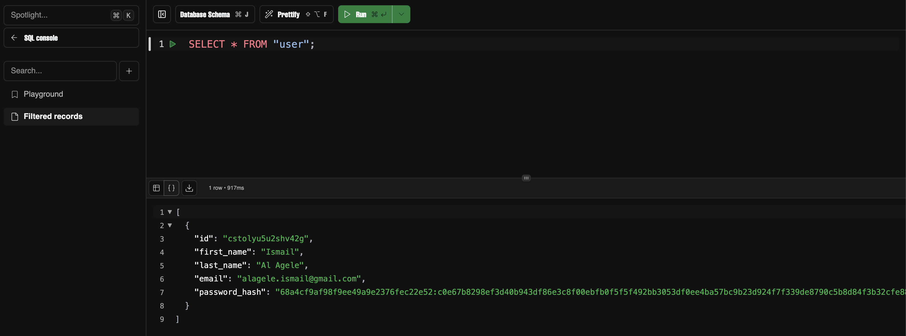

# Instagram Clone

I built this (Instagram Clone) project to deepen my understanding of nearly every core aspect of SvelteKit 
from grouped routing and data fetching to authentication and database integration.

## Tech Stack

    |       Components     |                    Technology                       |
    |----------------------|-----------------------------------------------------|                     
    | Package Manager      | npm                                                 |
    | Frontend & Backend   | SvelteKit + TypeScript                              |
    | Authentication       | Lucia (includes bcrypt)                             |
    | Database Host        | Neon (serverless)                                   |
    | Database             | PostgreSQL                                          |
    | ORM                  | Drizzle + drizzle-zod/Extension                     |
    | Styling              | Tailwind, shadcn-svelte(UI) & Lucide-svelte(ICONS)  |
    | Deployment           | Vercel                                              |
    | Validation           | Zod: TS schema validation                           |
    | Form Library         | Superforms (only for SvelteKit)                     |

## Features of This Project:

    - User authentication: Register, Login, and Logout
    - Email & Password Validation
    - Drag and drop by Create in Sidebar
    - Toggle between Dark and Light mode

## Database:

